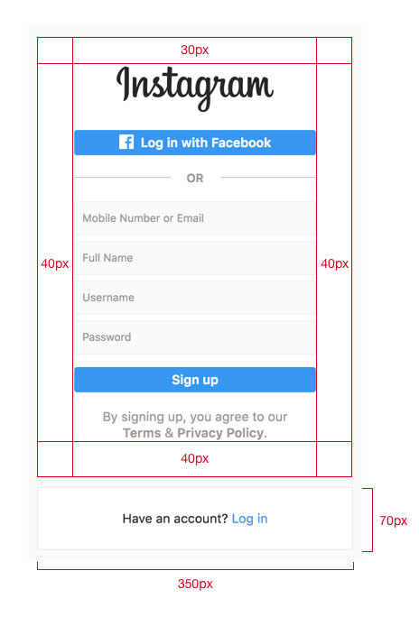
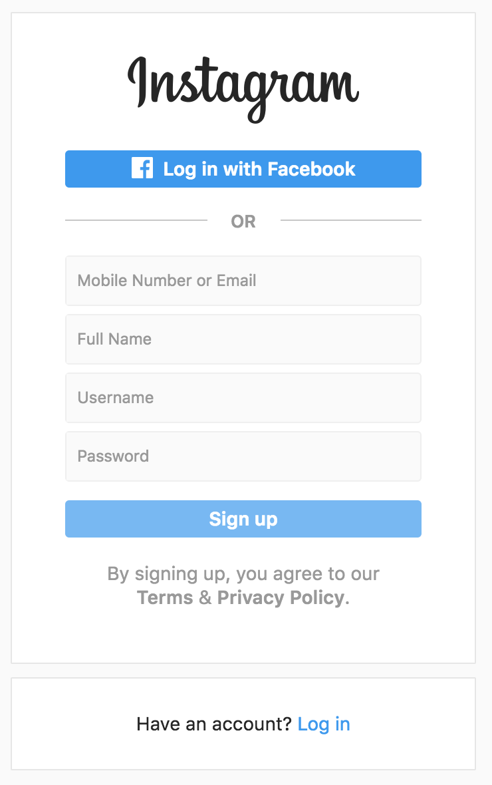

# Instagram Login

## Indications

1. Use HTML to create the entire structure and Sass to write styles.
2. Use Sass variables to control colors in CSS
3. Take advantage of nesting in Sass using a wildcard –and &– to print CSS class names.

## Steps
- Create a pen called `Instagram Login` and configure Sass as pre-processor.

## Design Specs

##### Dimensions

```
General
  Text color: 999
  corner radius: 3px
  text size: 14px
  border color: E6E6E6
  blue: 3897f0
Inputs
  Border color: EFEFEF
  Fill color: FAFAFA
  height 36px
Logo
  dimensions: 175 x 51
```



## Final Result


